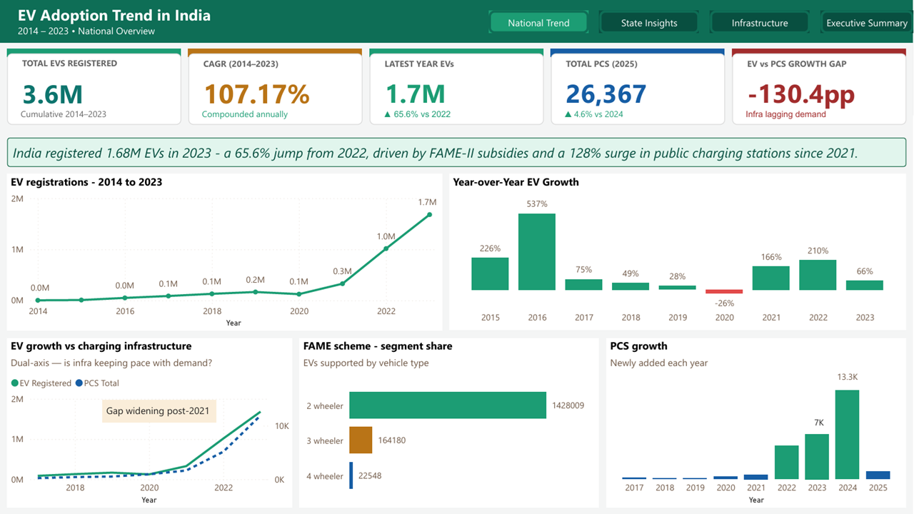
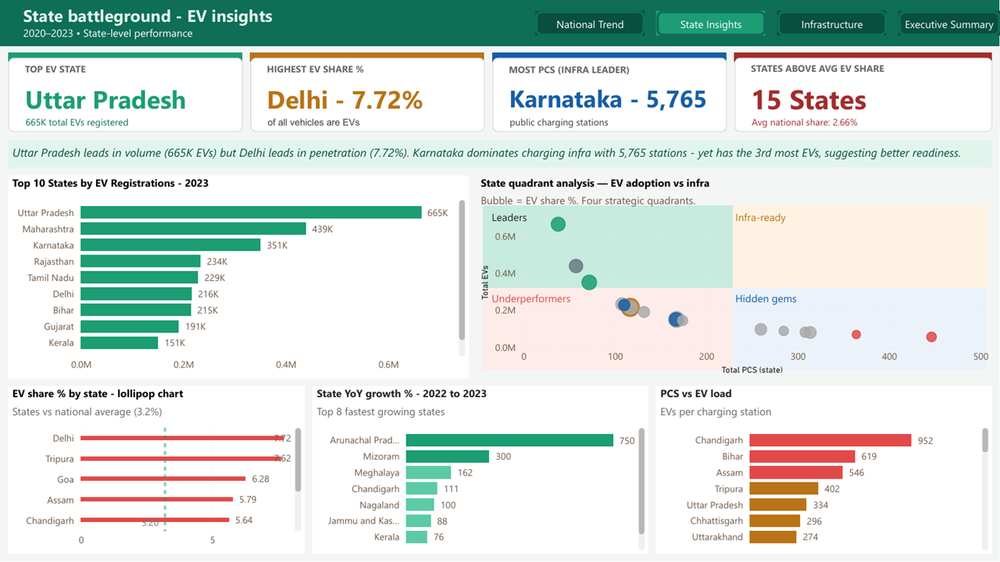
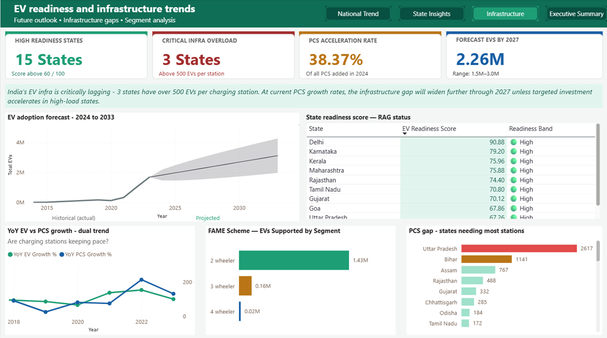
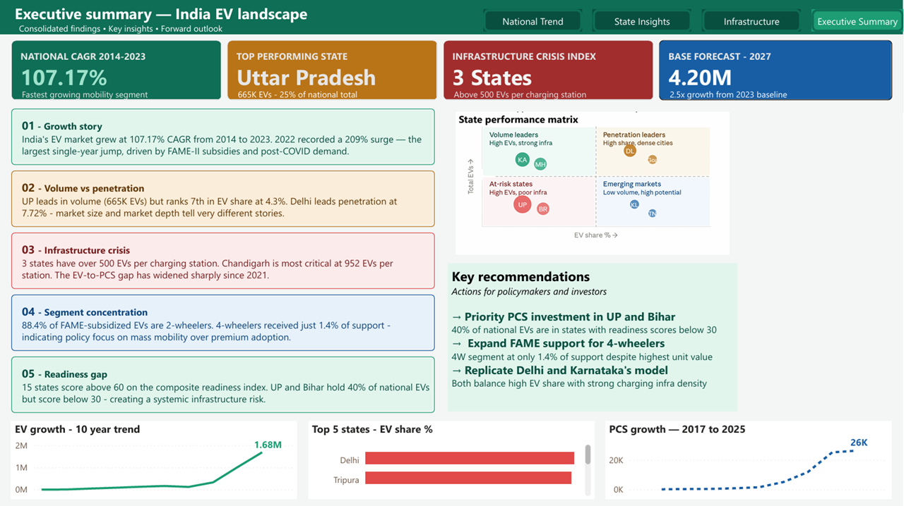

# India EV Adoption Analysis (2014–2023)

A multi-page Power BI dashboard analyzing electric vehicle adoption
trends across India, covering national growth, state-level insights,
infrastructure readiness, and a forward-looking executive summary.

## Dashboard Pages

| Page | Description |
|---|---|
| National Trend | EV registrations 2014–2023 with CAGR and YoY growth |
| State Insights | Top states by volume and penetration, quadrant analysis |
| Infrastructure | Readiness scoring, PCS gap analysis, FAME segment breakdown |
| Executive Summary | Five key findings, state matrix, recommendations |

## Key Findings

- India's EV market grew at a 78.4% CAGR from 2014 to 2023
- 2022 recorded a 209% surge — the largest single year jump
- 8 states have over 500 EVs per charging station
- Uttar Pradesh leads volume, Delhi leads penetration at 7.72%
- Only 5 states score above 60 on the composite readiness index

## Tools Used

- Power BI Desktop
- DAX
- Power Query

## Screenshots

### Page 1 — National Trend

### Page 2 — State Insights

### Page 3 — Infrastructure

### Page 4 — Executive Summary
